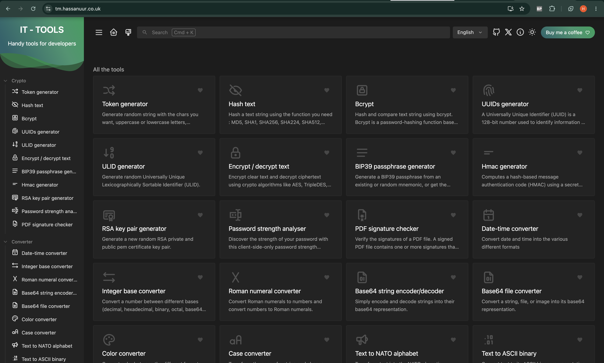
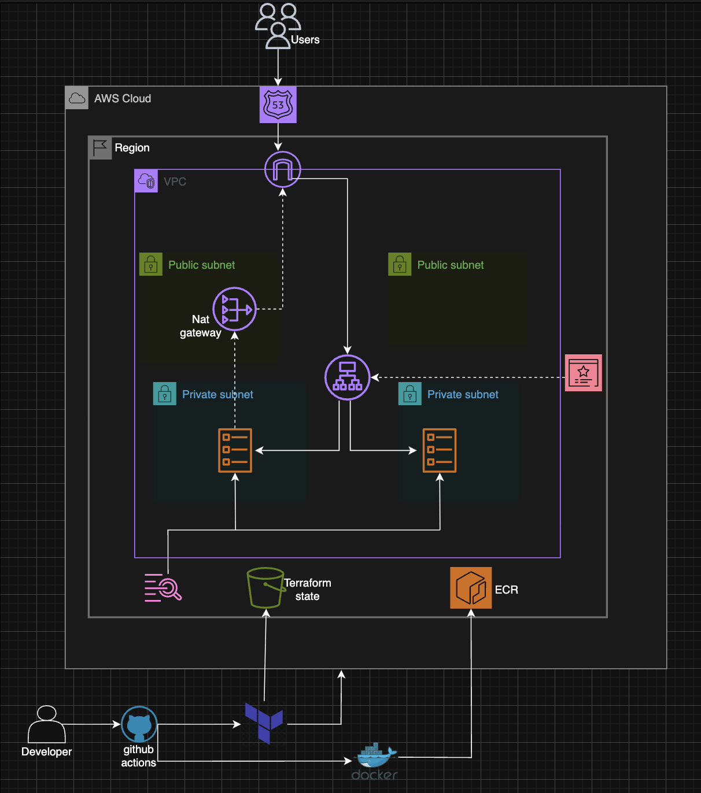

# IT Tools — ECS Deployment

**Live:** https://tm.hassanuur.co.uk

## Overview

This project provisions a fully automated, production-grade cloud deployment on AWS from a single terraform apply.
Infrastructure is defined entirely as code across organised Terraform modules, containerised with a hardened 
multi-stage Docker build, and deployed via four dedicated GitHub Actions pipelines using OIDC authentication 
with no static AWS credentials anywhere in the codebase. 

## App



## Architecture



**Infrastructure:**
- Custom VPC with public and private subnets across 2 availability zones
- ECS Fargate tasks in private subnets — not directly internet-facing
- Application Load Balancer in public subnets with HTTPS termination
- HTTP to HTTPS redirect enforced at ALB level
- ACM certificate auto-validated via Route 53 DNS
- NAT Gateway allowing private subnet tasks to pull from ECR
- CloudWatch logs with 7-day retention
- ECR with image scanning on every push

**Security:**
- Non-root container user running nginx on port 8080
- ECS tasks only accept traffic from ALB security group
- OIDC authentication for GitHub Actions — no static AWS keys stored
- Trivy vulnerability scanning in CI pipeline
- S3 remote state with native locking

## Local Setup

Requirements: Docker

```bash
cd app
docker build -t it-tools .
docker run -p 8080:8080 it-tools
# Visit http://localhost:8080
curl http://localhost:8080/health
# {"status":"ok"}
```
